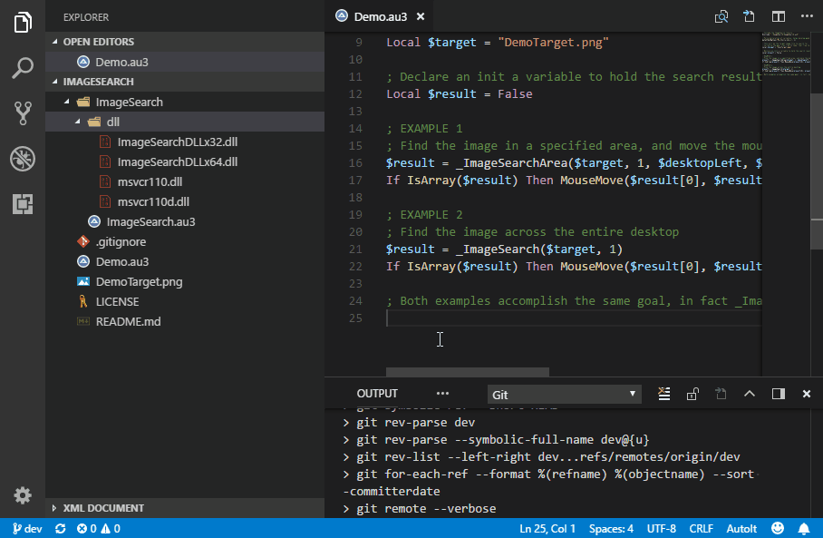

# ImageSearch with AutoIt
Go beyond pixel detection with AutoIt.

## Overview

I needed the ability for [AutoIt](https://www.autoitscript.com) to find something on the screen matching a reference image. Unfortunately, this is not an available built-in feature. There are functions available for checking individual pixels, but no way to match groups of pixels or images.

I found a solution in [this thread](https://www.autoitscript.com/forum/topic/148005-imagesearch-usage-explanation/?page=4). The key is the [AutoHotkey ImageSearch](https://www.autohotkey.com/docs/commands/ImageSearch.htm) function. Someone extracted the **ImageSearch** code from *AutoHotkey*, packed it up in to convenient DLLs, and put together a **UDF** library that acts as a wrapper.

I took the **UDF** library and made the following improvements to it:

* Updated relevant functions to return an array of `[x,y]` coordinates on success, and `False` on failure. Original search functions returned `True/False` success status, while coordinate results were stored in external variables passed in by reference.
* Updated relevant functions with an extra parameter for a window handle, making it possible to limit the search area to the boundaries of a specified window.
* Added the ability to handle multi-monitor desktops by re-defining absolute desktop boundaries as new global variables `desktopLeft`, `desktopTop`, `desktopRight`, `desktopBottom`, `desktopWidth`, and `desktopHeight`.

## Example

Here is the simplest example of what utilizing ImageSearch looks like.

```autoit
; Include the ImageSearch library
#include ".\ImageSearch\ImageSearch.au3"
; This will be the target image file to search for
Local $target = "DemoTarget.png"
; Declare an init a variable to hold the search result
Local $result = False
; Find the image across the entire desktop
$result = _ImageSearch($target, 1)
; If found, move the mouse to it
If IsArray($result) Then MouseMove($result[0], $result[1])
```



## To-Do

- [ ] Improve code documentation via comments.
